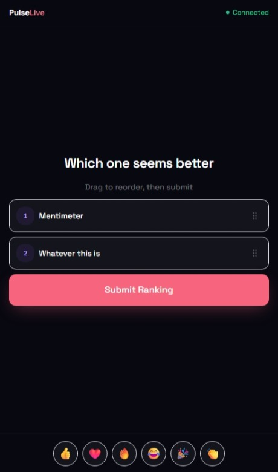
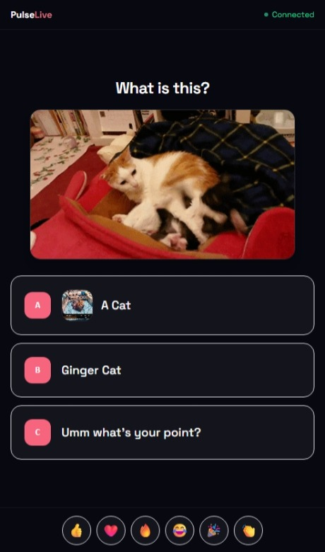

# PulseLive

> Interactive presentations without the SaaS tax. Self-host it, own your data, pay nothing.

PulseLive is a free, open-source alternative to Mentimeter. Run live polls, word clouds, Q&A, quizzes, ratings, and rankings during your presentations — with real-time audience responses, beautiful visualizations, and full session analytics. No vendor lock-in, no per-seat pricing, no data leaving your infrastructure.

Built with React, Vite, Tailwind CSS, and Supabase.

---

## Why PulseLive?

Tools like Mentimeter charge per presenter, gate features behind paid tiers, and own your audience's response data. PulseLive gives you everything — every interaction type, full analytics, unlimited sessions — on infrastructure you control. Deploy it once and it's yours forever.

- No subscription. No per-seat fees. No feature paywalls.
- Your Supabase instance means your data stays with you.
- Audience members join instantly via a 6-digit code or QR scan — no app, no account required.
- All interaction types are available out of the box, not locked behind a plan.

---

## Features

### Six interaction types, all included

**Live Polls** — Multiple-choice questions with animated bar charts that update in real time as votes come in. Watch consensus form in front of your audience.

**Word Clouds** — Collect words and short phrases that render as a dynamic, growing cloud. Great for brainstorming, icebreakers, and open-ended prompts.

**Open Q&A** — Free-form text responses displayed in a live scrolling feed visible to everyone in the room. No moderation queue, no friction.

**Rating Scales** — Star-based rating inputs with live average visualizations. Ideal for feedback, satisfaction scores, and retrospectives.

**Ranking** — Participants drag and drop to rank a list of options. Results aggregate into a live leaderboard the whole room can see.

**Quiz Mode** — Timed questions with a designated correct answer revealed after voting closes. Scores are tracked per participant for a competitive, gamified feel.

### Presenter experience

- Dedicated presenter view with slide navigation, live response count, and a stopwatch
- Lock and unlock voting per slide to control the pace
- Floating emoji reactions from the audience visible on the presenter screen
- Optional ambient background music during sessions
- Fullscreen mode for clean stage presentation

### Audience experience

- Join via 6-digit code or QR — works on any device with a browser
- See live results immediately after submitting a response
- Smooth, mobile-first UI that works on phones without any installation

### Analytics and history

- Every session is saved automatically with full per-slide response data
- Session history page with response breakdowns for each slide type
- Export session data to Excel for offline analysis or reporting
- Analytics overview across all presentations and sessions

### Deployment

- One-command deployment assistant for Windows (`deploy.bat`) and Mac/Linux (`deploy.sh`)
- Guided setup for Supabase project creation, database migrations, and Netlify deployment
- Environment variable documentation included

---

## Quick Start

```bash
git clone https://github.com/your-username/pulse-live.git
cd pulse-live
```

Then run the deployment assistant:

- **Windows:** double-click `deploy.bat`
- **Mac/Linux:** `chmod +x deploy.sh && ./deploy.sh` (requires [PowerShell Core](https://github.com/PowerShell/PowerShell#get-powershell))

The script walks you through Supabase setup, database migrations, and Netlify deployment interactively.

> You'll need [Node.js](https://nodejs.org) installed. The script will offer to install the Supabase and Netlify CLIs automatically if they're missing.

For the full manual setup guide see **[docs/getting-started.md](./docs/getting-started.md)**.
See **[docs/environment-variables.md](./docs/environment-variables.md)** for all required environment variables.

---

## Tech Stack

| Layer | Technology |
|---|---|
| Frontend | [React 18](https://react.dev) + [TypeScript](https://www.typescriptlang.org) |
| Build | [Vite](https://vitejs.dev) |
| Styling | [Tailwind CSS](https://tailwindcss.com) + [shadcn/ui](https://ui.shadcn.com) |
| Backend / Realtime | [Supabase](https://supabase.com) — Postgres, Auth, Realtime subscriptions |
| Animations | [Framer Motion](https://www.framer.com/motion) |
| Data Fetching | [TanStack Query](https://tanstack.com/query) |
| Drag and Drop | [@dnd-kit](https://dndkit.com) |
| Deployment | [Netlify](https://netlify.com) |

---

## License

See [LICENSE.md](./LICENSE.md).

---

## Screenshots

### Landing Page


### Login


### Presentation View


### Participant View






### Analytics (Post-Session)

