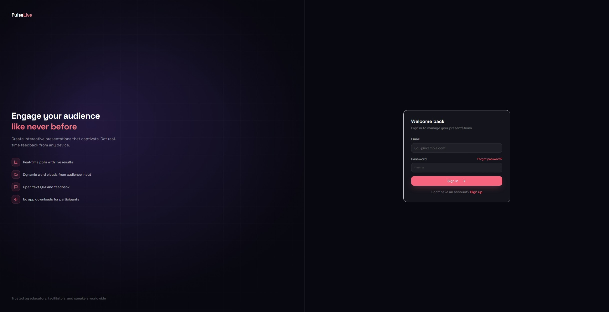
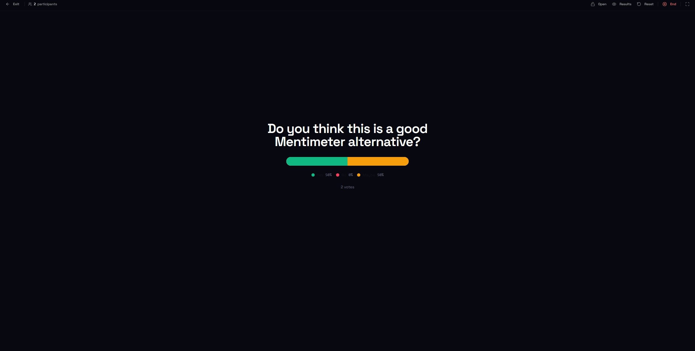
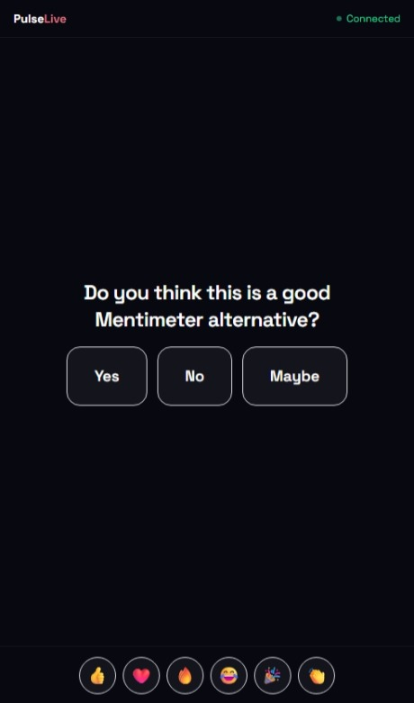
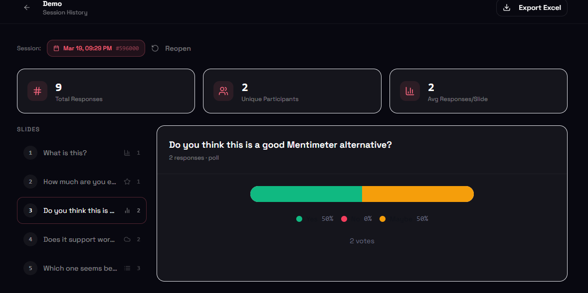

# PulseLive v0.1.0 — Initial Release

> Interactive presentations without the SaaS tax. Self-host it, own your data, pay nothing.

This is the first public release of **PulseLive** — a free, open-source alternative to Mentimeter. Run live polls, word clouds, Q&A, quizzes, ratings, and rankings during your presentations with real-time audience responses, beautiful visualizations, and full session analytics. No vendor lock-in, no per-seat pricing, no data leaving your infrastructure.

---

## What is PulseLive?

PulseLive lets presenters run interactive sessions where audience members join via a 6-digit code or QR scan — no app, no account required. Responses appear live on the presenter's screen as they come in. Every session is saved automatically with full analytics you can export.

It is built to replace tools like Mentimeter for teams and individuals who don't want to pay per-presenter fees, hand their audience data to a third party, or be gated out of features by a pricing tier.

---

## Features in this release

### Six interaction types

**Multiple Choice / Live Poll**
Audience votes on one of several options. Results render as an animated bar chart that updates in real time as votes arrive. Supports up to any number of options per slide.

**Word Cloud**
Participants submit words or short phrases. Responses render as a growing, dynamic word cloud visible to everyone in the room. Great for brainstorming, icebreakers, and open-ended prompts.

**Open Q&A / Open Text**
Free-form text responses displayed in a live scrolling feed on the presenter screen. No moderation queue, no friction — every response appears immediately.

**Rating Scale**
Star-based rating input with a live average score visualization. Ideal for feedback collection, satisfaction scores, and retrospectives.

**Ranking**
Participants drag and drop to rank a list of options. Results aggregate into a live leaderboard the whole room can see update in real time.

**Quiz Mode**
Timed questions with a designated correct answer revealed after voting closes. Scores are tracked per participant for a competitive, gamified feel.

---

### Presenter experience

- Dedicated full-screen presenter view with slide navigation controls
- Live response count displayed per slide
- Built-in stopwatch to track time per slide
- Lock / unlock voting per slide to control the pace of the session
- Floating emoji reactions sent by audience members appear on the presenter screen
- Optional ambient background music during sessions (powered by SomaFM — Groove Salad, Drone Zone, Deep Space, Lush)
- Fullscreen mode for clean stage presentation

### Audience / participant experience

- Join via 6-digit code or QR code — works on any device with a browser, no installation required
- See live results immediately after submitting a response
- Smooth, mobile-first UI optimised for phones
- Emoji reaction bar to send reactions to the presenter in real time

### Slide editor

- Create and manage presentations from a dashboard
- Add, reorder (drag-and-drop), and delete slides
- Configure each slide type with its own options (choices, correct answer, rating max, items to rank, etc.)
- Optional image attachment per slide
- Slide preview in the editor sidebar

### Session management

- Start a live session from any presentation with one click
- Auto-generated unique 6-digit join code per session
- QR code generated automatically for the join URL
- Sessions close automatically when the presenter ends them
- Stale session cleanup via a scheduled Supabase function

### Analytics and session history

- Every session is saved automatically with full per-slide response data
- Session history page with response breakdowns for each slide type
- Visual charts for each slide's responses in the history view
- Export session data to Excel (`.xlsx`) for offline analysis or reporting
- Analytics overview page with aggregate stats across all presentations and sessions

### Authentication

- Email / password sign-up and login via Supabase Auth
- Password reset flow with email link
- Protected routes — unauthenticated users are redirected to login
- User profiles with display name

---

## Tech stack

| Layer | Technology |
|---|---|
| Frontend | React 18 + TypeScript |
| Build tool | Vite 8 |
| Styling | Tailwind CSS v3 + shadcn/ui (Radix UI primitives) |
| Backend / Realtime | Supabase — Postgres, Auth, Realtime subscriptions |
| Animations | Framer Motion |
| Data fetching | TanStack Query v5 |
| Drag and drop | @dnd-kit |
| Charts | Recharts |
| Excel export | SheetJS (xlsx) |
| QR codes | qrcode.react |
| Deployment | Netlify |

---

## Database schema

Five tables, all with Row Level Security enabled:

| Table | Purpose |
|---|---|
| `profiles` | Auto-created on signup, stores display name and avatar |
| `presentations` | Slide decks owned by a user |
| `slides` | Individual slides with type, question, options, and order |
| `sessions` | A live session for a presentation, identified by a join code |
| `responses` | Audience answers linked to a session and slide |

Realtime is enabled on `sessions` and `responses` so the presenter view and participant view both update without polling.

---

## Deployment

PulseLive is designed to be deployed on **Netlify** (frontend) + **Supabase** (backend). Both have free tiers that are sufficient for most use cases.

### Automated deployment assistant

An interactive deployment script handles the full setup — Supabase project creation, database migrations, and Netlify deployment — with guided prompts.

- **Windows:** run `deploy.bat` (double-click or from a terminal)
- **Mac / Linux:** run `chmod +x deploy.sh && ./deploy.sh` (requires PowerShell Core)

The script will offer to install the Supabase CLI and Netlify CLI automatically if they are not present.

### Manual deployment

See [docs/getting-started.md](./docs/getting-started.md) for the full step-by-step manual setup guide.

### Environment variables

Only two environment variables are required:

| Variable | Description |
|---|---|
| `VITE_SUPABASE_URL` | Your Supabase project URL |
| `VITE_SUPABASE_PUBLISHABLE_KEY` | Your Supabase `anon` public key |

See [docs/environment-variables.md](./docs/environment-variables.md) for full details.

---

## Getting started

```bash
git clone https://github.com/Warhammer4000/pulse-live.git
cd pulse-live
```

Then run the deployment assistant or follow the manual guide in `docs/getting-started.md`.

For local development:

```bash
npm install
cp .env.example .env
# fill in your Supabase credentials in .env
npm run dev
```

---

## Screenshots

| | |
|---|---|
|  |  |
|  |  |
|  |  |

---

## License

See [LICENSE.md](./LICENSE.md).
